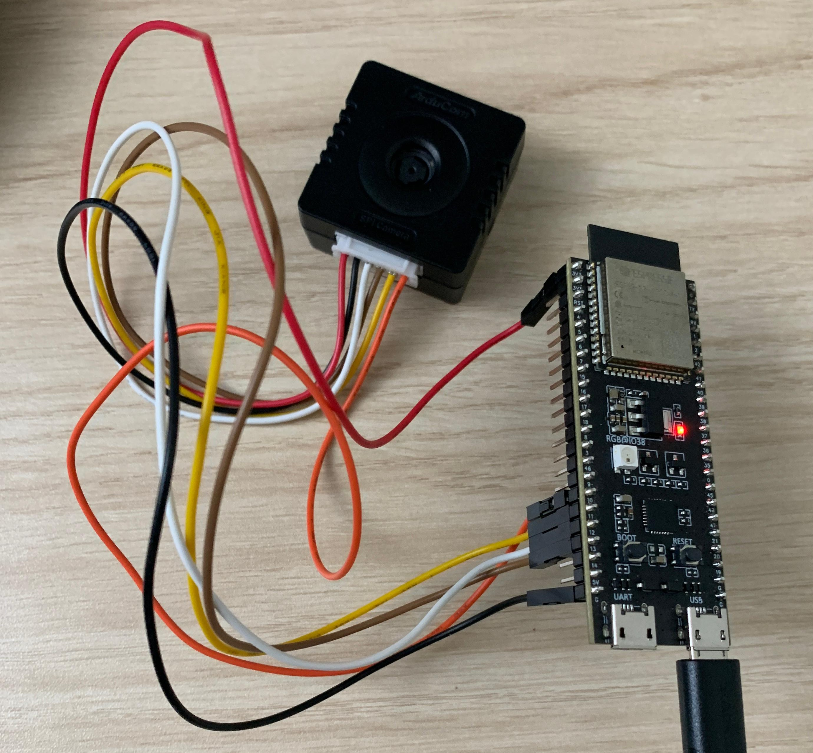
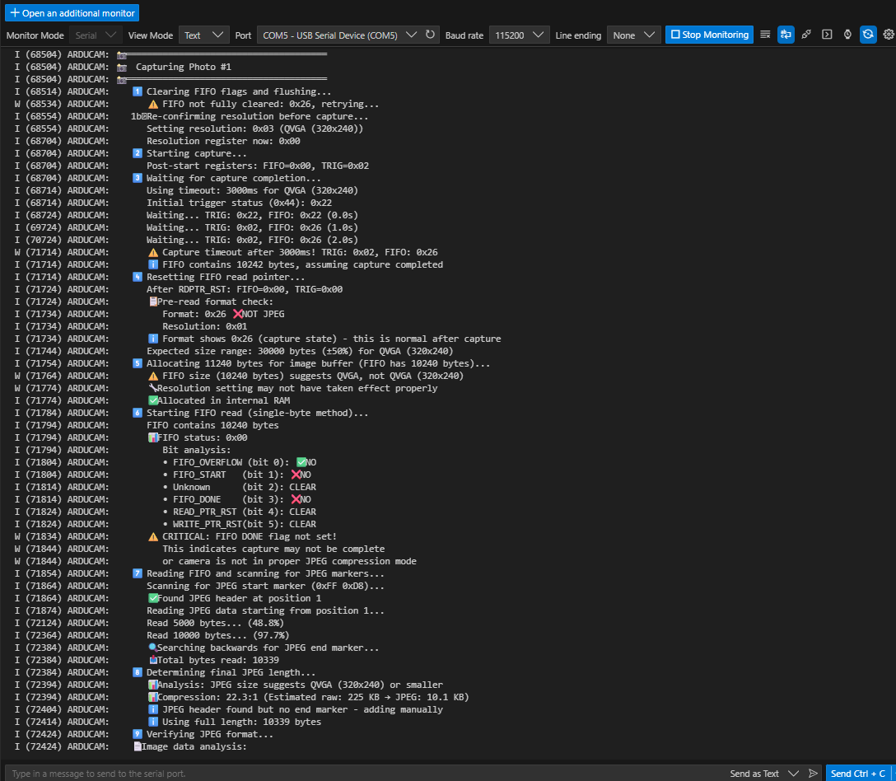

# ESP32-S3 ArduCAM WiFi Camera

A complete embedded camera system built on ESP32-S3 that captures JPEG images from an ArduCAM Mega (OV5640 sensor) over SPI and serves them via a web interface over WiFi.


## 🎯 Project Overview

This project demonstrates low-level peripheral interfacing, camera control, memory management, and wireless connectivity on a resource-constrained microcontroller. The system captures 320×240 JPEG images (~20KB) and provides a simple web interface for viewing and downloading them.

## 🔧 Hardware Requirements

- **ESP32-S3** development board
- **ArduCAM Mega** (OV5640 5MP camera module)
- **WS2812 RGB LED** (optional, for status indication)
- **Jumper wires** for connections

### Pin Configuration

| Component | ESP32-S3 Pin | Function |
|-----------|--------------|----------|
| ArduCAM CS | GPIO 10 | SPI Chip Select |
| ArduCAM MOSI | GPIO 11 | SPI Master Out |
| ArduCAM MISO | GPIO 13 | SPI Master In |
| ArduCAM SCK | GPIO 12 | SPI Clock |
| RGB LED | GPIO 38 | Status Indicator |
| BOOT Button | GPIO 0 | Capture Trigger |

## 🚀 Features

### Core Functionality
- **SPI Camera Interface**: Low-level register control of ArduCAM module
- **JPEG Capture**: Complete image capture pipeline with format validation
- **Memory Management**: Efficient buffer handling for constrained MCU environment
- **WiFi Connectivity**: HTTP server hosting captured images
- **Web Interface**: Simple HTML UI for image viewing and downloading

### Technical Highlights
- **Register-level SPI communication** with custom read/write functions
- **JPEG marker parsing** (SOI/EOI detection and validation)
- **Dynamic memory allocation** with heap monitoring and fragmentation handling
- **FreeRTOS task management** with watchdog integration
- **Status indication** via RGB LED (white=capturing, green=success, red=error)

## 📷 Project Gallery

### Hardware Setup

*ESP32-S3 development board with ArduCAM Mega connected via SPI*

### Web Interface

*Camera web interface displaying captured QVGA image with download functionality*

### Serial Monitor Output

*ESP-IDF monitor showing successful WiFi connection, camera initialization, and image capture process*

---

## Hardware Setup

- **MCU:** ESP32‑S3 module/board.
- **Camera:** ArduCAM Mega (OV5640).
- **Connections (example pinout):**
    - SPI2:
        - `MOSI` – GPIO 11
        - `MISO` – GPIO 13
        - `SCLK` – GPIO 12
        - `CS`   – GPIO 10
    - Status LED:
        - WS2812 RGB LED data – GPIO 38
    - Button:
        - BOOT button – GPIO 0 (input with pull‑up)

Adjust pins in `main/hello_world_main.c` if your board uses different GPIOs.

---

## Building and Flashing

Prerequisites:

- ESP‑IDF v5.5.x installed and `IDF_PATH` set.
- Toolchain set up for ESP32‑S3.

From the project root:

```bash
idf.py set-target esp32s3
idf.py build
idf.py flash
idf.py monitor
```

On Windows PowerShell you might use:

```pwsh
idf.py set-target esp32s3
idf.py build
idf.py flash
idf.py monitor
```

Watch the serial output for:

- Wi‑Fi connection logs.
- Assigned IP address (e.g. `10.0.0.53`).
- Camera initialization status and captured image size.

---

## Using the Web Interface

1. Power up the board and flash the firmware.
2. Open the serial monitor (`idf.py monitor`) and wait for:
     - `WiFi connected! IP: x.x.x.x`
3. On a device on the same network, open a browser and go to:
     - `http://<board_ip>/`
4. Press the **BOOT** button on the ESP32‑S3 to capture a new image.
5. Refresh the web page to see the latest photo and/or:
     - Click “Download” to save the full JPEG from `/image`.

---

## What This Project Demonstrates

This project is intended as a **portfolio piece** and covers:

- SPI bus configuration and register‑level device control.
- Working with a camera module that hides sensor I2C behind an SPI control interface and FIFO.
- FreeRTOS task design and watchdog integration.
- Memory‑safe buffer management on a microcontroller (no PSRAM assumed).
- Wi‑Fi networking and implementing a simple HTTP server in ESP‑IDF.
- Practical GPIO usage for buttons and RGB LED status indications.

---

## Future Extensions

- Switch to the official ArduCAM Mega library to enable higher resolutions (VGA/HD/UXGA) with full sensor register tables.
- Add multiple image storage (e.g. ring buffer) and a gallery view in the web UI.
- Add configuration endpoints (change Wi‑Fi credentials, JPEG quality, or LED behavior from a browser).
- Integrate basic authentication for the web interface.
